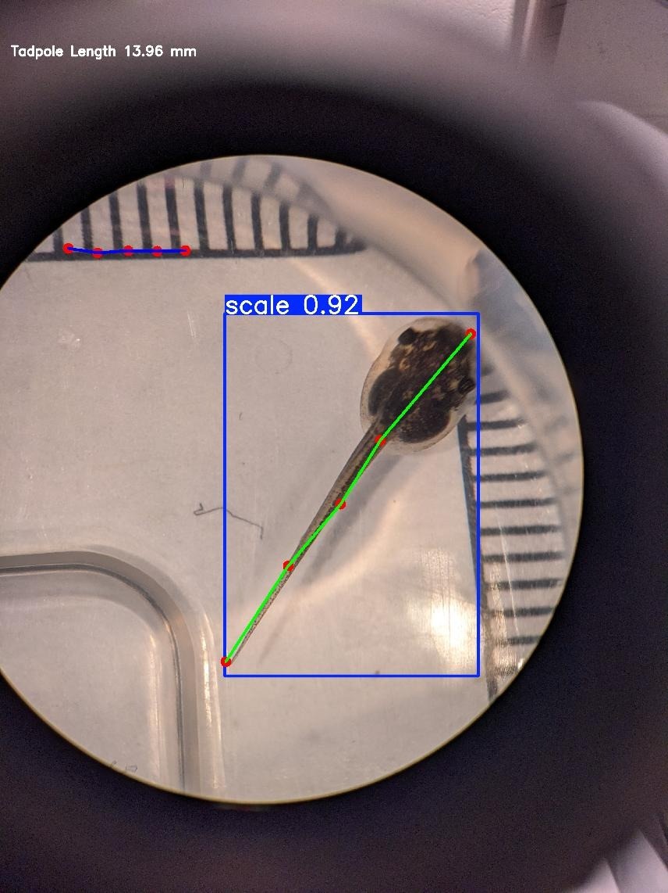

# ML-Tadpolemetry

This project uses two machine learning models fine-tuned from the the Ultralytics YOLO series to approximate the length of a tadpole in a single image based on keypoints along the tadpole's body. The first model finds n-keypoints along the tadpole's body from tip to tail, and the second marks marks keypoints along the embedded scale in each image to relate the tadpole segment lengths in pixels to a real world dimension.



## Usage (WIP)

Install dependencies:
```
uv pip install -e .
```

Run inference on a directory of images:
```
tadpolemetry measure  
```

Results are written to `<output_dir>/results.csv`. Failed images are copied to `<output_dir>/failed/`.
